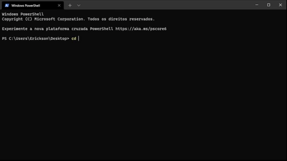

# Project Webscraping

Project that scrapes the last three articles on the site: https://www.infomoney.com.br/mercados/ and prints the information.
Information is removed dynamically, so it is modified at all times.


## Run Locally

Clone the project

```bash
  git clone https://github.com/Erickson-Eng/WebScraping.git
```

Go to the project directory

```bash
  cd WebScraping
```

Start the server

```bash
  java -jar .\target\WebScrapy-1.0-SNAPSHOT.jar
```


## Demo

<p align="center">
    
<\p>

## Authors

- [@erickson-eng](https://github.com/Erickson-Eng)


  